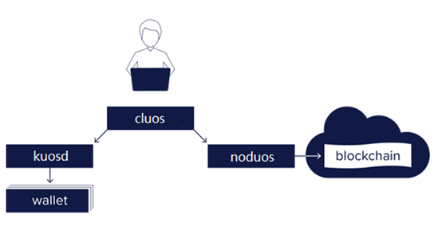

# 第一章 介绍

## 1.1 什么是UOS？

**UOS是Ulord的一条侧链**，它不会发布新的代币，UOS链上所有的币都是在主链（Ulord链）发起兑换交易之后才会产生，并不会凭空出现，也不会凭空消失，UOS和UT的兑换比率为1:1。

UOS采用DPOS委托投票选举共识算法，生产节点由持币者投票选举产生，出块时间为1秒。每个共识主节点需要抵押一部分UOS代币到一个帐户，如果发现共识主节点作恶，该节点的抵押资金将被扣除。

UOS是一个对普通用户和开发者友好的区块链底层平台，它具有极强的扩展性和安全性，可以支持上万级别的dapp应用同时运行，为开发DAPP提供底层的模板。

UOS提供有区块浏览器，钱包，合约开发等各种工具给dapp开发者使用。

UOS提供有内存买卖，cpu抵押特色服务，对于资源不足的用户可以租借使用。

**UOS共识让持币者投票决定链的走向**，它是一个完全自治的系统。

## 1.2 UOS架构

·         noduos\(node + uos = noduos\) -- UOSIO节点守护进程，可以配置插件来运行节点。主要用途包括块生产、专用API端点和本地开发。

·         cluos\(cli + uos = cluos\) -- 用于与区块链交互并管理钱包的命令行接口工具。

·         kuosd\(key + uos = kuosd\) -- 将UOSIO秘钥安全存储在钱包中的组件。

## 1.3 UOS的特点

1.UOS采用DPOS共识算法，杜绝了资源浪费，很好的解决了网络延迟和数据吞吐量问题。

2.UOS采用插件化设计，插件是一种高度解耦的设计模式，它把不同的程序功能模块独立开来，需要时再进行自由组合。

3.UOS账户使用短名字（账户），以便用户记忆。

4.UOS账户具有权限分级，具有灵活的权限系统，有利于账户安全，有利于做复杂权限验证。

5.UOS链不发行代币，由UT兑换可得UOS。

6.UOS性能高，TPS可达4000，能承载足够多的交易和应用。

7.UOS由用户投票选出生产节点（见证人），BP节点用于生产区块和链的管理。BP节点相互连接组成生产网络。

8.对于作恶的生产节点，会有一定惩罚，有利于UOS链的安全和稳定运行。

9.用户通过抵押代币来获取资源的使用权。UOS网络中主要有3种资源，即CPU、NET和RAM。

10.UOS能很好的预防DDOS攻击，因为攻击者只能使用与其UOS代币相应比例的带宽资源。

11.UOS转账可以秒到，且不存在交易费，仅需花费一定资源，因此具有更广泛的使用价值。

12.UOS支持智能合约，且在UOS上开发DAPP也比较简单。

13.UOS代币丢失无法找回，请务必备份您的账户私钥和钱包秘钥。

## 1.4 UOS的优势

1.UOS是Ulord的侧链之一，二者之间采用双向锚定技术进行资产交互，并不会增发。

2.UOS侧链可以扩展，因此百万级的TPS只要扩展侧链就可以达到。

3.UOS新增联盟合约，用户通过锁定一定数量的UT到联盟地址来兑换UOS。

4.UOS共识采取一币一票，防止BP节点之间贿选，它是一个自治的系统。

5.UOS加入了BP节点惩罚机制，如果发现BP节点作恶，该节点的抵押资金将被扣除，有利6.于UOS链的安全和稳定。

7.UOS将增加合约冻结机制，用于合约发现缺陷或被攻击之后的紧急处理，防止缺陷扩散。

8.UOS增加事件监听插件，它提供了一套基于事件订阅发布的机制来实时推送平台的日志事件给感兴趣的客户端，用户可以订阅感兴趣的账户事件、合约事件、区块事件等。

9.UOS的区块容量大，有2M。UOS每个区块间隔1000毫秒，550毫秒用来打包区块，450毫秒用来处理交易，交易处理时间比较多。这从本质上增加了用户使用的CPU时长。

10.UOS对链的CPU使用百分比阈值进行了创新设计，一般链的CPU使用百分比达到10%-30%就会拥堵；而UOS具有独特的CPU模型，当用户所用的CPU资源达到全网的50%的时候才会发生拥堵，改善了CPU使用率，从而提高TPS。

## 1.5 UOS可以支撑的应用

UOS侧链可以支持各种区块链的应用:

1．供应链金融，让供应商的票据和产品信息上链，任何一个环节出了问题都可从链上追溯。

2．资产上链，用户用现有资产作为抵押，发行相应资产的代币，这就让对应的资产流通起来，可以进行融资等各种处理。

3．内容领域，版权登记，版权信息上链存储。

4．游戏领域等，比如现在流行的画布游戏，dice游戏。

客户在做应用的过程中，可以自己开发合约，自己发行代币，也可以委托我们开发。同时可以利用我们提供的平台工具直接部署，使用平台提供的接口会更加简单。

## 1.6 UT在Ulord和UOS之间转移流程

这是最简单的操作示意图。

UT和UOS之间全部采用联盟的方式进行，这样能尽可能的保证去中心化。

**1.Ulord向联盟的交易（抵押交易）**

用户使用Ulord的钱包，向联盟地址转入一定数量的UT；联盟验证交易并等待交易成熟。

**2.联盟向UOS的交易**

抵押交易验证成功并经过足够多的块确认后，联盟通过UOS上的合约向用户指定的账户释放相应数量的UOS代币。

**3.UOS向联盟的交易（赎回交易）**

用户在UOS链上向联盟账户转入一定数量的UOS代币；联盟验证该交易。

**4.联盟向Ulord的交易**

赎回交易验证成功并经过足够多的块确认后，联盟向用户指定的Ulord地址转入相应数量的UT。

## 附：

### 什么是侧链？

侧链，是基于某个主链的一个相对概念。它是一种技术，允许您将您的代币从一条链转移到另一条链，并在另一条链上使用它们，同时在稍后的时间点您可将它们转移回原来的链上。

### 侧链的优点

1.侧链和主链网络挂勾，作为二级（secondary）区块链具有不同的功能和特点。

2.用户可以向侧链转移主链资产，在侧链平台部署并使用智能合约时，并不需要投资另一种新型加密货币。

3.侧链的代码和数据独立，侧链出现的任何安全上的风险不会影响到主链。

### 什么是双向锚定？

1.双向锚定技术通常被认为是一种将主链资产转移到侧链的方法，通过双向锚定技术，侧链上的代币资产也能和主链上的资产进行互换，从而实现链间资产转移。

2."转移"其实是一个错觉，实际上就是锁定和释放。通过将资产锁定在其中一条链的一笔交易当中，使得该部分资产不可用，然后在另一条链上创建一笔描述该锁定资产的交易。从而有效地实现资产在主链和侧链之间进行互换。

3.需要可信的第三方角色保管锁定资金。

4.常见的双向锚定设计：（此处不做具体介绍，您如果有兴趣可以查阅相关资料）

 –SPV模式（SPV证明）

 –驱动链（矿工投票）

 –多重签名监管（联盟节点）

 –混合设计

5.UOS采用联盟节点进行主链和侧链之间的双向锚定操作，这里联盟节点需要大家进行投票选出，或者是有公信力的公司或组织担任，不允许个人担任，节点数量要保证5个以上，这样才能尽可能的保证去中心化的运行。

