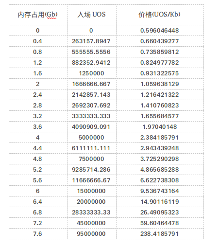
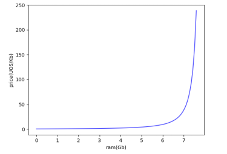
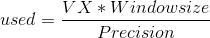
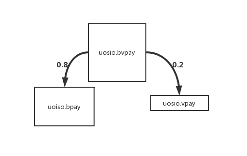

# 第六章 基本概念

## 6.1 账户

账户是对UOS用户的指代，于UOS而言，每一个账户即一个用户。UOS账户名称由小写字母a-z,数字1-5组成，普通用户的长度为12位，小于12位的称为短号，短号要通过竞拍，或者由其他短号创建获得。  
用命令查看一个UOS的账户：

```text
cluos --url http://rpc.uos.iccob.com:9008 get account "baodaotulong"
created: 2019-03-29T08:46:56.000
permissions:
    owner     1:    1 UOS5A4sYXU6SA5kyKjbu76r9xapgrzotjhLEgPSZzDzMBJpw1559Y
       active     1:    1 UOS5A4sYXU6SA5kyKjbu76r9xapgrzotjhLEgPSZzDzMBJpw1559Y
memory:
    quota:     3.491 KiB    used:      3.49 KiB  
net bandwidth:
    staked:          0.1000 UOS           (total stake delegated from account to self)
    delegated:       0.0000 UOS           (total staked delegated to account from others)
    used:               432 bytes
    available:        15.63 MiB  
    limit:            15.63 MiB  
cpu bandwidth:
    staked:          0.1000 UOS           (total stake delegated from account to self)
    delegated:       0.0000 UOS           (total staked delegated to account from others)
    used:             2.939 ms  
    available:        2.122 sec  
    limit:            2.125 sec  
UOS balances:
    liquid:            1.3648 UOS
    staked:            0.2000 UOS
    unstaking:         0.0000 UOS
    total:             1.5648 UOS
producers:
    staked:            0.2000 UOS
    <not voted>
    total:             0.0000 UOS
```

一个账户的基本信息包含权限组成、内存信息、cpu信息、net信息、余额信息、投票信息。

### 6.1.1 权限组成

UOS的账户默认有两个权限：owner和active。拥有对应权限的私钥，便可以用使用该用户的相应权限。active权限用来进行一般操作，比如转账、购买内存、抵押、投票调用一般合约。owner权限能行使active权限的一切操作，并且能够修改用户的active权限组成和owner权限组成。  
比如：baodaotulong的owner和active权限均是由公钥组成：

> UOS5A4sYXU6SA5kyKjbu76r9xapgrzotjhLEgPSZzDzMBJpw1559Y

那么，只要拥有上面公钥对应的私钥，我们便可以在地球上每一个有网络的地方使用“baodaotulong”账户active或者owner身份进行的任何合法操作。我们把用户某权限的私钥称为该用户该权限的**权限私钥。**  
账户的某一权限可以由公钥组成，也可以有其他账户的权限组成\(比如uosio.prods\)，或者由他们相互结合组成。若是A账户的X权限由B账户Y权限组成，则拥有B账户Y权限的“权限私钥”就可以解锁A的X权限。  
对如下权限：

> active 1: 1 UOS5A4sYXU6SA5kyKjbu76r9xapgrzotjhLEgPSZzDzMBJpw1559Y

active的后的第一个“１”是**权限阈值，公钥前面的“１”是该公钥的权重，要解锁某一权限，需要权限私钥对应的权重之和要能大于或等于权限阈值。关于权限更多介绍，可以跳转到**[**多重签名章节**](https://mastering-uos.gitbook.io/mastering-uos/di-er-zhang-ji-ben-gai-nian#24-duo-zhong-qian-ming)**。**  
内存信息、cpu信息、net信息和投票信息将在以后的章节中介绍。

### 6.1.2 权限修改

UOS系统中，我们可以修改账户的权限组成，或增加新的权限。以baodaotulong账户为例，我们先查看该账户的权限：

```text
cluos --url http://rpc.uos.iccob.com:9008 get account "baodaotulong"
created: 2019-03-29T08:46:56.000
permissions:
    owner     1:    1 UOS5A4sYXU6SA5kyKjbu76r9xapgrzotjhLEgPSZzDzMBJpw1559Y
       active     1:    1 UOS5A4sYXU6SA5kyKjbu76r9xapgrzotjhLEgPSZzDzMBJpw1559Y
......(省略)
```

#### 修改active权限

需要active权限或owner权限。

```text
cluos --url http://rpc.uos.iccob.com:9008 set account permission baodaotulong active '{"threshold":1, "keys":[{"key":"UOS71LKEAFJqtgeX58G4iMx3k6aEYXQGiZmkC9pww2sgQpho89Wa1","weight":1}],"accounts":[]}' owner -p baodaotulong@owner
```

修改后查看账户权限组成：

```text
cluos --url http://rpc.uos.iccob.com:9008 get account "baodaotulong"
created: 2019-03-29T08:46:56.000
permissions:
    owner     1:    1 UOS5A4sYXU6SA5kyKjbu76r9xapgrzotjhLEgPSZzDzMBJpw1559Y
       active     1:    1 UOS71LKEAFJqtgeX58G4iMx3k6aEYXQGiZmkC9pww2sgQpho89Wa1
......(省略)
```

#### 修改owner权限

必须使用owner权限。

```text
cluos --url http://rpc.uos.iccob.com:9008 set account permission baodaotulong owner '{"threshold":2, "keys":[{"key":"UOS71LKEAFJqtgeX58G4iMx3k6aEYXQGiZmkC9pww2sgQpho89Wa1","weight":2}],"accounts":[]}' -p baodaotulong@owner
```

修改后查看账户权限组成：

```text
cluos --url http://rpc.uos.iccob.com:9008 get account "baodaotulong"
created: 2019-03-29T08:46:56.000
permissions:
    owner     2:    2 UOS71LKEAFJqtgeX58G4iMx3k6aEYXQGiZmkC9pww2sgQpho89Wa1
       active     1:    1 UOS71LKEAFJqtgeX58G4iMx3k6aEYXQGiZmkC9pww2sgQpho89Wa1
......(省略)
```

**注意**：以上命令也可以修改权限的权重和阈值；修改owner权限时，我们就修改了该权限的权重及阈值。

**创建或修改其他权限**

除了两个原生权限以外，UOS还支持自定义权限。我们新增一个voting权限，该权限是active的子权限。且该权限由 UOS5BmFG8H42XvKGN1Lfq94iDgwHoQCgtCPCqvoeN6ibqCHhi7XX9 对应的私钥和testaccountx的active权限共同控制。

```text
cluos --url http://rpc.uos.iccob.com:9008 set account permission baodaotulong voting '{"threshold":2,"keys":[{"key":"UOS71LKEAFJqtgeX58G4iMx3k6aEYXQGiZmkC9pww2sgQpho89Wa1","weight":1}],"accounts":[{"permission":{"actor":"testaccountx","permission":"active"},"weight":1}],"permissions":[{"perm_name":"voting","parent":"active"}]}' -p baodaotulong@active
```

修改后查看账户权限组成：

```text
cluos --url http://rpc.uos.iccob.com:9008 get account "baodaotulong"
created: 2019-03-29T08:46:56.000
permissions:
    owner     2:    2 UOS71LKEAFJqtgeX58G4iMx3k6aEYXQGiZmkC9pww2sgQpho89Wa1
       active     1:    1 UOS71LKEAFJqtgeX58G4iMx3k6aEYXQGiZmkC9pww2sgQpho89Wa1
          voting     2:    1 UOS71LKEAFJqtgeX58G4iMx3k6aEYXQGiZmkC9pww2sgQpho89Wa1, 1 testaccountx@active
......(省略)
```

**注意**：新增voting权限后，并**不能**直接使用该权限进行**任何**操作，我们还需要给该权限绑定action。

#### 绑定action

这里，我们绑定uosio合约的voteproducer这个action。

```text
cluos --url http://rpc.uos.iccob.com:9008 set action permission baodaotulong uosio voteproducer voting
```

当然我们也可以给voting权限绑定多个action，如转账。

```text
cluos --url http://rpc.uos.iccob.com:9008 set action permission baodaotulong uosio.token transfer voting
```

#### 解除绑定

移除权限之前，我们需要解绑该权限绑定的**所有**action，否则无法移除。

```text
cluos --url http://rpc.uos.iccob.com:9008 set action permission baodaotulong uosio voteproducer NULL
```

```text
cluos --url http://rpc.uos.iccob.com:9008 set action permission baodaotulong uosio.token transfer NULL
```

#### 移除权限

既然可以新增权限，当然也可以移除权限。

```text
cluos --url http://rpc.uos.iccob.com:9008 set account permission baodaotulong voting 'NULL' -p baodaotulong@active
```

修改后查看账户权限组成：

```text
cluos --url http://rpc.uos.iccob.com:9008 get account "baodaotulong"
created: 2019-03-29T08:46:56.000
permissions:
    owner     2:    2 UOS71LKEAFJqtgeX58G4iMx3k6aEYXQGiZmkC9pww2sgQpho89Wa1
       active     1:    1 UOS71LKEAFJqtgeX58G4iMx3k6aEYXQGiZmkC9pww2sgQpho89Wa1
......(省略)
```

## 6.2 交易

UOS中，任何一个操作最后均归结为合约的调用，**交易实际是由用户授权的一个或多个合约调用的组合。**

### 6.2.1 交易组成

一个交易包含一个或多个action,每一个action对应一次合约的直接调用。比如一条转账交易，是调用uosio.token合约的transfer操作，一条交易可以用一个json来描述，可以通过http命令把某个合法交易的json发送给节点打包执行。如id为如下的交易

> 366616970c7995a935e3263571bd543937a6512cc358c66a91ed449fbb0dcd21

```text
"trx": {
      "expiration": "2019-04-03T04:10:59",　
      "ref_block_num": 8415,
      "ref_block_prefix": 725978374,
      "max_net_usage_words": 0,
      "max_cpu_usage_ms": 0,
      "delay_sec": 0,
      "context_free_actions": [],
      "actions": [
        {
          "account": "uosio.token",
          "name": "transfer",
          "authorization": [
            {
              "actor": "uosiopokerbp",
              "permission": "active"
            }
          ],
          "data": {
            "from": "uosiopokerbp",
            "to": "gongyingfund",
            "quantity": "195.0000 UOS",
            "memo": ""
          },
          "hex_data": "50cf559056ea30d590a65e6c3acf266530c11d000000000004554f530000000000"
        }
      ],
      "transaction_extensions": [],
      "signatures": [
        "SIG_K1_KbJgJmMUKBVmmhCg6yUsJKifeZDbAFpQd78bbDvTkVemCbjbNUq2meDxXWUMCpCV9tsR5YWV9qCXbsY41AQUunZ5bwY83q"
      ],
      "context_free_data": []
    }
```

expiration：交易的过期时间，交易在UOS上的最迟执行时间，如果交易在expiration还未执行，则此交易再也不会被执行。  
ref\_block\_num：交易的参考区块号  
ref\_block\_prefix：交易的参考区块的hash前缀  
max\_net\_usage\_words：交易的net使用上限，为０不设限制  
max\_cpu\_usage\_ms：交易的cpu使用上限，为０不受限制  
delay\_sec：交易的延迟时间，为０代表非延迟交易  
context\_free\_actions：上下文无关的行为。

### 6.2.3 actions

此交易的具体调用的合约，上文中的转账交易直接调用的合约的文字解释如下：

```text
uosiopokerbp用户使用自己的active权限，调用是uosio.token合约的transfer方法，传入参数为：一个json:
{
    "from": "uosiopokerbp",
    "to": "gongyingfund",
    "quantity": "195.0000 UOS",
    "memo": ""
}
```

### 6.2.4 signatures

此交易的签名。需要与actions声明的调用权限一致，如果声明了uosiopokerbp的active权限，就需要用uosiopokerbp账号active权限的权限私钥进行签名。  
在区块链浏览器上查看这条交易：  
[https://explorer.uosio.org/transactions/5513440/366616970c7995a935e3263571bd543937a6512cc358c66a91ed449fbb0dcd21](https://explorer.uosio.org/transactions/5513440/366616970c7995a935e3263571bd543937a6512cc358c66a91ed449fbb0dcd21)

## 6.3 内存、cpu、net

uos的资源包含：cpu、net、内存\(ram\)。用户的每个操作都需要链来执行，执行需要花费一定的cpu资源，而每个操作都是用数据来进行表达的，需要在区块中占据一定的容量，用net资源计量。合约需要非易失性的存储某些数据，事实上，这些非易失性数据是存在与每一个节点上，是物理受限的，这些以ram计量。  
这一节我们还是用“baodaotulong”这个账号举例：

```text
cluos --url http://rpc.uos.iccob.com:9008 get account "baodaotulong"
created: 2019-03-29T08:46:56.000
permissions:
    owner     1:    1 UOS5A4sYXU6SA5kyKjbu76r9xapgrzotjhLEgPSZzDzMBJpw1559Y
       active     1:    1 UOS5A4sYXU6SA5kyKjbu76r9xapgrzotjhLEgPSZzDzMBJpw1559Y
memory:
    quota:     3.491 KiB    used:      3.49 KiB  
net bandwidth:
    staked:          0.1000 UOS           (total stake delegated from account to self)
    delegated:       0.0000 UOS           (total staked delegated to account from others)
    used:               432 bytes
    available:        15.63 MiB  
    limit:            15.63 MiB  
cpu bandwidth:
    staked:          0.1000 UOS           (total stake delegated from account to self)
    delegated:       0.0000 UOS           (total staked delegated to account from others)
    used:             2.939 ms  
    available:        2.122 sec  
    limit:            2.125 sec  
UOS balances:
    liquid:            1.3648 UOS
    staked:            0.2000 UOS
    unstaking:         0.0000 UOS
    total:             1.5648 UOS
producers:
    staked:            0.2000 UOS
    <not voted>
```

```text
购买内存：cluos system buyram ......
卖出内存：cluos system sellram ......
抵押cpu、net：cluos system delegatebw ......
取消抵押：cluos system undelegatebw ......
```

### 6.3.1 内存

UOS的节点本质运行在具体的物理计算机上的一个程序，这个程序将一些常用的数据储存在计算机的内存之中，账户的基本信息便是其中的一种。由于UOS的区块链特性，为了确保“共识”的准确，每一个节点运行的程序是一样的，所以每一个节点的UOS程序在内存中存储的是同一份状态数据，因此内存资源的容量于节点数目无关，并不会因为节点的增多而增多。因为计算机物理内存资源有限并且成本高昂，所以UOS的内存是付费使用的。  
比如：baodaotulong购买了“3.491KB”的内存，已经使用了“3.49KB”的内存，那么他只有0.001KB的内存用来存放自己的某些数据了。  
UOS的内存容量现为８G,这意味这每个UOS节点程序要求自己计算机的内存里面有８G的容量是用来存“常用的状数据”的。这些常用的包含合约本身，以及合约内部自定义的一些数据。  
**UOS的内存**是根据bancor协议进行自动计费的。  
公式如下：

> 得到的容量\(Byte\) = \(当前剩余的容量 \*付款的UOS\)/\(池中的UOS + 付款的UOS\)
>
> 得到的UOS = \(池中的UOS\* 卖出的RAM\) / \(剩余的容量 ＋ 卖出的RAM\)

内存资金池的初始值参数为500W,所以由第一个公式，当有500W的UOS入场内存时，池中的UOS为1000W，计算出：得到的容量= 总容量/2 = 4GB 。  
接下来，详细价格如下表：



作图如下：



### 6.3.2 cpu和net

在考虑UOS资源的时候,要意识到UOS的节点是运行在真实计算机上的一个进程，并且每台这样的计算机运行的程序都是一致的，故UOS的资源并不因为节点的增加而增加。一个交易传输到UOS的出块节点，该节点会先执行这个交易，然后打包进区块。因此，UOS的cpu描述的是交易执行所需要的时间，net描述的是交易本身所占容量的大小。cpu和net是可再生资源，用户使用后，无论多少，都会随时间慢慢恢复，可用的总量与自己的抵押有关。  
baodaotulong用户抵押了0.1000 UOS的cpu，已使用了 2.939ms，可用 2.122s，意味着baodaotulong在接下来的24小时内，如果发起交易，则这些交易的执行时间之和不能大于2.122s。  
baodaotulong用户抵押了0.1000 UOS的net，已使用了432bytes，可用15.63MB，意味着baodaotulong在接下来的24小时内，如果发起交易，则这些交易的容量之和不能大于15.63MB。  
我们可用用区块链浏览器查看交易消耗的cpu和net情况：  
[https://explorer.uosio.org/transactions/5513440/366616970c7995a935e3263571bd543937a6512cc358c66a91ed449fbb0dcd21](https://explorer.uosio.org/transactions/5513440/366616970c7995a935e3263571bd543937a6512cc358c66a91ed449fbb0dcd21)

> "cpu\_usage\_us": 609 "net\_usage\_words": 16

cpu和net资源的平均使用量，是一种改进的指数移动平均模型：


其中:  
VX: 资源的平均使用量；  
VX’: 上次资源的平均使用量；  
unit: 本次交易消耗的资源量；  
Precision:精度补偿系数，防止unit过小出现整除为零；  
Windowsize:窗口大小；  
Futuredistance:上个更新时刻为周期起点，当前时刻离周期终点的距离。  
当每个块都有更新时，Futuredistance+1 = Windowsize，上试退化成普通的指数平均模型。  
当前的cpu更新使用量：



对某个用户而言，Windowsize的大小是24小时的区块数量。  
而用户cpu和net资源的可用量与自身抵押和UOS的繁忙程度有关，UOS用虚拟资源的概念表述。UOS上的交易越多，UOS越繁忙，UOS的虚拟资源越少，用户可使用的资源就越少，用户抵押的越多，可使用的资源就越多。实际上，UOS区块的cpu和net的更新使用量计算公式也是依照以上两个公式，不过unit为一个区块总的cpu和net使用量，Windowsize为60。  
下面的命令是查询UOS系统的全局参数，以cpu为例，当区块的cpu当前更新使用量小于target\_block\_cpu\_usage\_pct\_max\_block\_cpu\_usage，UOS会判定系统处于闲暇，抬升UOS的虚拟cpu大小。反之亦然，虚拟cpu的取值区间为\[max\_block\_cpu\_usage，max\_block\_cpu\_usage\_1000\]。

```text
cluos -u https://rpc3.uosio.org:8080 get table uosio uosio global
{
 "rows": [{
     "max_block_net_usage": 2097152,
     "target_block_net_usage_pct": 1000,
     "max_transaction_net_usage": 524288,
     "base_per_transaction_net_usage": 12,
     "net_usage_leeway": 500,
     "context_free_discount_net_usage_num": 20,
     "context_free_discount_net_usage_den": 100,
     "max_block_cpu_usage": 450000,
     "target_block_cpu_usage_pct": 1000,
     "max_transaction_cpu_usage": 150000,
     "min_transaction_cpu_usage": 100,
     "max_transaction_lifetime": 3600,
     "deferred_trx_expiration_window": 600,
     "max_transaction_delay": 3888000,
     "max_inline_action_size": 4096,
     "max_inline_action_depth": 4,
     "max_authority_depth": 6,
     "max_ram_size": "8589934592",
     "total_ram_bytes_reserved": "4578540092",
     "total_ram_stake": "57069206716",
     "last_producer_schedule_update": "2019-04-08T10:21:10.000",
     "last_pervote_bucket_fill": "1554716648000000",
     "pervote_bucket": 78924164,
     "perblock_bucket": 221709552,
     "total_unpaid_blocks": 287821,
     "total_activated_stake": "31137840000",
     "thresh_activated_stake_time": "1548746649000000",
     "last_producer_schedule_size": 13,    "total_producer_vote_weight": "30137840000.00000000000000000",
    "last_name_close": "2019-04-07T11:43:02.000"
  }
 ],
 "more": false
}
     "total_producer_vote_weight": "30137840000.00000000000000000",
     "last_name_close": "2019-04-07T11:43:02.000"
   }
 ],
 "more": false
}
```

## 6.4 多重签名

UOS的多重签名有两种方式：一种是手动多重签名，一种是利用uosio.msig合约进行多重签名。

### 6.4.1 手动多重签名

设置baodaotulong的账户的active权限为多公钥控制：

```text
cluos -u https://rpc3.uosio.org:8080  set account permission baodaotulong active '{"threshold":2,"keys":[{"key":"UOS5A4sYXU6SA5kyKjbu76r9xapgrzotjhLEgPSZzDzMBJpw1559Y","weight":1},{"key":"UOS7piQ2XhQi5DdQmBfny6QvQqCJfaph5GYRqYcEozxA6b3Fq36om","weight":1}],"accounts":[]}' -p baodaotulong@active
```

baodaotulong账户的组成如下：

```text
cluos -u http://rpc.uos.iccob.com:9008 get account baodaotulong
permissions:
    owner     1:    1 UOS5A4sYXU6SA5kyKjbu76r9xapgrzotjhLEgPSZzDzMBJpw1559Y
       active     2:    1 UOS5A4sYXU6SA5kyKjbu76r9xapgrzotjhLEgPSZzDzMBJpw1559Y, 1 UOS7piQ2XhQi5DdQmBfny6QvQqCJfaph5GYRqYcEozxA6b3Fq36om
```

发起一条转账交易,不广播，不签名\(**构造一个没有签名的交易json**\):

```text
cluos -u https://rpc3.uosio.org:8080 transfer -d -s -j -x 3600 baodaotulong aaaaaaaaaaaa "0.0010 UOS" >tr.json
```

tr.json如下：

```text
{
 "expiration": "2019-04-09T02:28:42",
 "ref_block_num": 35586,
 "ref_block_prefix": 3431691675,
 "max_net_usage_words": 0,
 "max_cpu_usage_ms": 0,
 "delay_sec": 0,
 "context_free_actions": [],
 "actions": [{
     "account": "uosio.token",
     "name": "transfer",
     "authorization": [{
         "actor": "baodaotulong",
         "permission": "active"
       }
     ],
     "data": "c0268d3a5393a839608c31c618638c310a0000000000000004554f530000000000"
   }
 ],
 "transaction_extensions": [],
 "signatures": [],
 "context_free_data": []
}
```

然后分别用avtive权限的两个私钥签名：

```text
cluos -u http://rpc.uos.iccob.com:9008 sign tr.json
```

分别复制签名字段：

```text
"signatures": [
 "SIG_K1_K2KC8742bKq6YrDnHUqhHVerU6NRDq26SAJGMSSnn5bWZzLKMma8XtNwFVjMBKYTcrnStnfiQr5NZuPuA1FDLntK53vzJF"
 ]
.......
"signatures": [
 "SIG_K1_K8REbV6MX2uebfx5whW4dVeXsGBj9ejdifmkBtKzpkURMifSNXwEwz6RXP8vjBpxquMt8BWTK6Xu4ZkqLMqzk4SK5JkmXQ"
 ]
```

将tr.json的signatures字段用上面两个签名填充：

```text
"signatures":["SIG_K1_K2KC8742bKq6YrDnHUqhHVerU6NRDq26SAJGMSSnn5bWZzLKMma8XtNwFVjMBKYTcrnStnfiQr5NZuPuA1FDLntK53vzJF" , "SIG_K1_K8REbV6MX2uebfx5whW4dVeXsGBj9ejdifmkBtKzpkURMifSNXwEwz6RXP8vjBpxquMt8BWTK6Xu4ZkqLMqzk4SK5JkmXQ"]
```

最后将交易发送到rpc节点：

```text
cluos -u http://rpc.uos.iccob.com:9008 push transaction -s tr.json
```

会返回一个json，包含交易id:

> 41454b52b491f22468abbe8967df570a4961b63452cdb20743e65885b6bca7c0

浏览器查询：[https://explorer.uosio.org/transactions/5999587/41454b52b491f22468abbe8967df570a4961b63452cdb20743e65885b6bca7c0](https://explorer.uosio.org/transactions/5999587/41454b52b491f22468abbe8967df570a4961b63452cdb20743e65885b6bca7c0)

### 6.4.2 调用uosio.msig合约的多重签名

使用uosio.misg合约合约同样达到多重签名的目的，但是多重签名合约只面向权限组成为账户的情况，手动多重签名则没有这个限制：  
更改账户的额权限，便于测试：

```text
 cluos -u https://rpc3.uosio.org:8080  set account permission baodaotulong active '{"threshold":2,"keys":[],"accounts":[{"permission":{"actor":"bithumbshiny","permission":"active"},"weight":1},{"permission":{"actor":"testertester","permission":"active"},,"weight":1}]}' -p baodaotulong@active
```

查看权限：

```text
cluos -u https://rpc3.uosio.org:8080 get account baodaotulong
created: 2019-03-29T08:46:56.000
permissions:
    owner     1:    1 UOS5A4sYXU6SA5kyKjbu76r9xapgrzotjhLEgPSZzDzMBJpw1559Y
       active     2:    1 bithumbshiny@active, 1 testertester@active
```

baodaotulong的active权限阈值为２，需要bithumbshiny的active权限以及testertester的active权限才能解锁。

发起一个提案：baodaotulong往aaaaaaaaaaaa转0.001个UOS。

```text
cluos -u  https://rpc3.uosio.org:8080 multisig propose transf   '[{"actor": "bithumbshiny", "permission": "active"},{"actor": "testertester", "permission": "active"}]' '[{"actor": "baodaotulong", "permission": "active"}]' uosio.token transfer '{"from":"baodaotulong","to": "aaaaaaaaaaaa", "quantity": "0.0010 UOS", "memo": ""}' bithumbshiny -p bithumbshiny
交易id:35fb04bc93d0e9b3a33e5bb5c94f2cf9e2d2cd9ea7500e7cf8cc99b254bd0d89
```

查看提案：

```text
//查看提案hex编码
cluos -u https://rpc3.uosio.org:8080 get table uosio.msig bithumbshiny proposal
//查看提案赞同信息
cluos -u https://rpc3.uosio.org:8080  get table uosio.msig bithumbshiny approvals
```

赞同提案，需要两个权限均赞同：

```text
cluos -u https://rpc3.uosio.org:8080 multisig approve bithumbshiny transf '{"actor": "bithumbshiny", "permission": "active"}' -p bithumbshiny
cluos -u https://rpc3.uosio.org:8080 multisig approve testertester transf '{"actor": "testertester", "permission": "active"}' -p testertester
```

执行提案：

```text
cluos -u https://rpc3.uosio.org:8080 multisig exec bithumbshiny transf -p bithumbshiny
交易id:14255495bcafc1d0e6977b47234a600eba8cbe3a2e5df8f12ad84b8a0d750333
```

以上是对某一个合约执行发起提案，我们也可以对具体某一个交易发起提案，这要求我们先构造好一个交易json\(见手动多重签名\)：

```text
cluos multisig propose_trx [OPTIONS] proposal_name requested_permissions transaction [proposer]
Positionals:
 proposal_name TEXT          proposal name (string) (required)
 requested_permissions TEXT  The JSON string or filename defining requested permissions (required)
 transaction TEXT            The JSON string or filename defining the transaction to push (required)
 proposer TEXT               Account proposing the transaction
```

## 6.5 共识主节点

共识主节点是UOS的出块节点和备用出块节点的统称，他们不仅仅提供UOS的出块以及验证，而且可以给其他ulord侧链提供共识服务，普通账户如果自己给自己抵押的cpu和net之和大于100000UOS,则可以申请成为活跃的出块用户，得票最多的前21位用户将有资格出块。将某个"活跃的出块用户"以及他在计算机上运行的UOS进程合称为一个共识主节点。  
申请成为共识主节点：

```text
cluos system regproducer [OPTIONS] account producer_key [url] [ulord_addr] [location]
Positionals:
 account TEXT                The account to register as a producer (required)
 producer_key TEXT           The producer's public key (required)
 url TEXT                    url where info about producer can be found
 ulord_addr TEXT             the ulord address  associative with candidate
 location UINT=0             relative location for purpose of nearest neighbor scheduling
```

producer\_key是出块公钥，用来打包块的时候签名，他的私钥不需要存放在钱包里。  
共识主节点列表的查看命令为：

```text
cluos -u http://rpc.uos.iccob.com:9008 get table uosio uosio producers
```

共识主节点的状态如下，需要uosio权限即是需要主节点发起提案，经由2/3投票通过。

| BP状态 | 需要权限 | 可否撤回抵押 | 可否出块 | 可否提奖 | 可否更改为其他状态 |
| :--- | :--- | :--- | :--- | :--- | :--- |
| active | bp自己 | 否 | 可 | 可 | 可 |
| release | uosio | 可 | 否 | 否 | 可 |
| remove | uosio | 抵押扣除 | 否 | 否 | 否 |

共识节点的奖池有三个：uosio.bvpay、uosio.bpay 、uosio.vpay  
他们之间的关系是，uosio.bvpay是奖池源头，uosio.bpay是出块奖池，uosio.vpay是投票奖池。



uosio.bvpay奖池源奖金的0.8将会进入出块奖池，奖池源的0.2将会进入投票奖池。  
查看总奖池：

```text
cluos --url http://rpc.uos.iccob.com:9008 get table uosio.bvpay uosio.bvpay bpvtpay
{
 "rows": [{
     "id": 0,
     "start_line": 1554185715,
     "laster_line": 1554340049,
     "dead_line": 1556777715,
     "inherit": "0.0000 UOS",
     "quantity": "244518.9665 UOS"
   },{
     "id": 1,
     "start_line": 1556777715,
     "laster_line": 1556777715,
     "dead_line": 1559369715,
     "inherit": "0.0000 UOS",
     "quantity": "0.0000 UOS"
   }
 ],
 "more": false
}
```

id = 0代表当前奖励周期，id = 1代表下一次奖励周期，周期长度为30天。  
假如现在的时间戳在周期０内，那么bp发起一次领奖，能领取多少钱呢？  
假设为领取时刻为ｔ,则奖池源发放的奖金为：

> out\_all = \(t - laster\_line\_0\) \*quantity\_0\* 10000 / \(dead\_line\_0 - laster\_line\_0\); \(6-5-1\)

奖金会分为两部分流入uosio.bpay与uosio.vpay。其中，0.8\*out\_all 进入uosio.bpay,0.2进入uosio.vpay。  
查看系统合约global参数：

```text
cluos --url http://rpc.uos.iccob.com:9008 get table uosio uosio global
{
 "rows": [{
     "max_block_net_usage": 2097152,
     "target_block_net_usage_pct": 1000,
     "max_transaction_net_usage": 524288,
     "base_per_transaction_net_usage": 12,
     "net_usage_leeway": 500,
     "context_free_discount_net_usage_num": 20,
     "context_free_discount_net_usage_den": 100,
     "max_block_cpu_usage": 450000,
     "target_block_cpu_usage_pct": 1000,
     "max_transaction_cpu_usage": 150000,
     "min_transaction_cpu_usage": 100,
     "max_transaction_lifetime": 3600,
     "deferred_trx_expiration_window": 600,
     "max_transaction_delay": 3888000,
     "max_inline_action_size": 4096,
     "max_inline_action_depth": 4,
     "max_authority_depth": 6,
     "max_ram_size": "8589934592",
     "total_ram_bytes_reserved": "4607367427",
     "total_ram_stake": "57844214019",
     "last_producer_schedule_update": "2019-04-04T05:46:45.000",
     "last_pervote_bucket_fill": "1554340049000000",
     "pervote_bucket": 27244585,
     "perblock_bucket": 100966841,
     "total_unpaid_blocks": 183296,
     "total_activated_stake": "29178000000",
     "thresh_activated_stake_time": "1548746649000000",
     "last_producer_schedule_size": 12,
     "total_producer_vote_weight": "28178000000.00000000000000000",
     "last_name_close": "2019-04-03T10:10:13.000"
   }
 ],
 "more": false
}
```

里面有4个参数与奖励有关

```text
"pervote_bucket": 27244585　　－－－　当前投票奖励资金池

"perblock_bucket": 100966841　－－－　当前块奖励资金池

"total_unpaid_blocks": 183296　－－－　当前未结算的区块数

"total_producer_vote_weight": "28178000000.00000000000000000"　－－－　当前投票总量
```

下面查看bp的具体情况，以“uoskkkkonebp”为例:

```text
cluos --url http://rpc.uos.iccob.com:9008 get table -l 1 -L uoskkkkonebp --index 1 uosio uosio producers
{
 "rows": [{
     "owner": "uoskkkkonebp",
     "total_votes": "1000000000.00000000000000000",
     "producer_key": "UOS8VjUQXSovjJ5LuubcAUK9r5LYda7j5dLTJcfrBHm6VSP2L3d8Y",
     "is_active": 1,
     "is_remove": 0,
     "release": 0,
     "url": "https://uoskkkkonebp.com/chain",
     "unpaid_blocks": 7577,
     "last_claim_time": "1554259259000000",
     "location": 0,
     "ulord_addr": "UWKPFY3dVd1z5zHancEFLy2XYpawbZWHNn"
   }
 ],
 "more": true
}
```

uoskkkkonebp的获得票数为1000000000.00000000000000000，未结算的生产区块数量为7385，最后一次领取奖励的时间戳为：1554259259000000  
那么如果ｔ时刻\(t &gt; 1554259259000000 + 3600\)  
uoskkkkonebp能领取出块的奖励为m,则:

> m = \(out\_all\*0.8 + perblock\_bucket\)\*unpaid\_blocks / total\_unpaid\_blocks \(6-5-2\)

uoskkkkonebp能领取的投票奖励为n,则:

> n= \(out\_all\*0.2 + pervote\_bucket\)\*total\_votes / total\_producer\_vote\_weight \(6-5-3\)
>
> 注：当n &gt;= 100 0000时，即投票奖励大于100UOS,n才有效,否则不会发放投票奖励

uoskkkkonebp能够领取的总奖励为：m+n ,由\(6-5-1\)、\(6-5-2\)、\(6-5-3\)式可算出，注意最后得到的单位是“分”，要转化为"元",需要除以10000.

