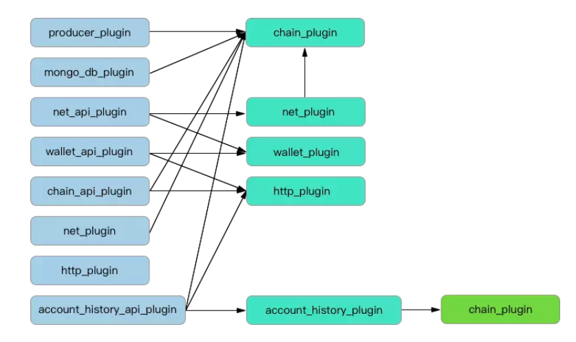

# 第七章 插件介绍

## 概述

在UOS的系统框架中，整个系统的功能是基于插件开发的，它们既相互独立而又紧密联系，按照不同的时序进行有条不紊地工作。在很多情况下，插件之间也存在相互之间的依赖的关系。下面将整个系统所设计的核心插件进行一一介绍，首先我们通过一张插件的依赖关系示意图来大致了解一下：

        从这里可以看出，我们比较核心的插件大约有七个，它们有的之间是相互通信的，黑色箭头所指即表示运行该插件所需要加载的其它插件。当然，这个加载的工作系统框架会自动进行，我们所需要理解的就是：根据我们的节点属性\(如生产节点、全节点、数据存储节点、私有节点等等\)的不同，我们会加载不同的插件来满足我们节点的正常工作。下面我们对所有插件的功能进行一个归纳。

## 插件

### **chain\_plugin**

读取本地不可逆区块链基本信息;

设置本地链检查点;

设置本地链参数;

设置可逆区块数据库参数;

设置账户黑/白名单;

设置智能合约黑/白名单;

重载区块链初始状态文件;

删除、重写、替换本地区块链数据（包括开始、停止等动作）。

### **net\_plugin**

建立节点之间握手并互联;

监听/发送/接收新交易请求;

监听/发送/接收新区块请求;

验证接收数据合法性。

### **http\_plugin**

监听/发送/接收新交易请求;

监听/发送/接收新区块请求;

验证接收数据合法性**。**

### **wallet\_plugin**

创建/读取钱包文件;

设置unlock timeout时间;

密钥导入钱包。

### **producer\_plugin**

生产/打包新区块数据;

对新区块签名;

对接收的区块进行验证，包括区块头合法性、签名合法性和交易合法性。

### **history\_plugin**

查询指定账户中指定公钥的所有历史交易记录。

### **acount\_history\_plugin**

指定区块查询;

指定账户状态查询;

指定交易查询。

### **mongo\_db\_plugin**

定义了保存并管理本地不可逆转区块链数据的MongoDB数据库基本配置插件,存储了所有区块数据、交易数据、action数据、用户名、用户管理系统等等。

### **chain\_api\_plugin**

定义了链控制器上所有rpc接口，可以通过rpc命令获取链控制器的相关信息。

### **net\_api\_plugin**

定义了所有与p2p网络相关的rpc接口，可以查看与控制本节点的p2p网络连接。

### **wallet\_api\_plugin**

定义所有与钱包相关的rpc指令。一般钱包都在本地调用，但也同时可以通过修改钱包的配置文件进行远程调用。

## **插件配置的基本原则**

### 生产节点

producer\_plugin

net\_plugin

http\_plugin

net\_api\_plugin           //根据需要配置

Chain\_plugin

chain\_api\_plugin     //根据需要配置

### 全节点

net\_plugin

net\_api\_plugin           //根据需要配置

chain\_plugin

chain\_api\_plugin

history\_api\_plugin

history\_plugin

### Mogodb存储节点

net\_plugin

net\_api\_plugin           //根据需要配置

chain\_plugin

chain\_api\_plugin

mogo\_db\_plugin

通过上面的插件介绍，我们可以大致了解到了各个系统插件的功能设计，为以后的分析区块数据的各个流程奠下良好的基础，以后我们将进一步介绍各个插件是如何具体地协调工作的。

