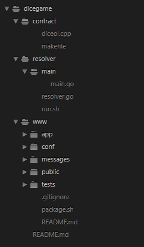
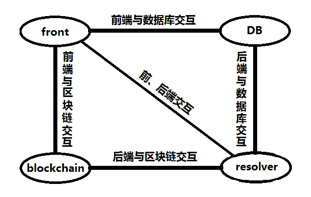
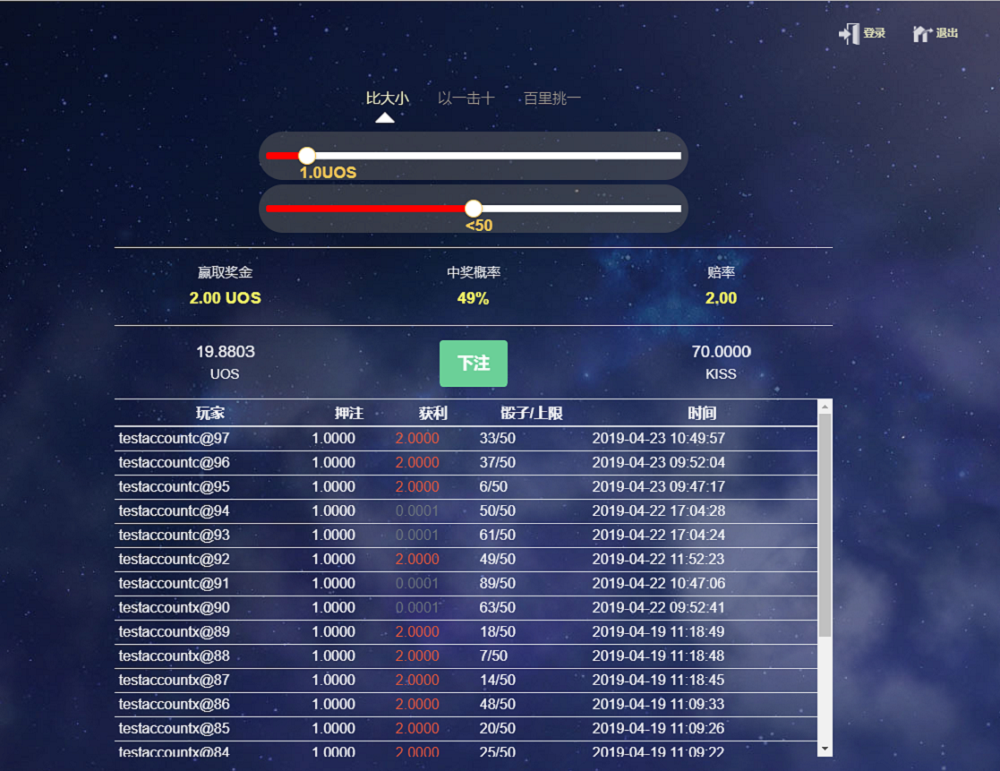
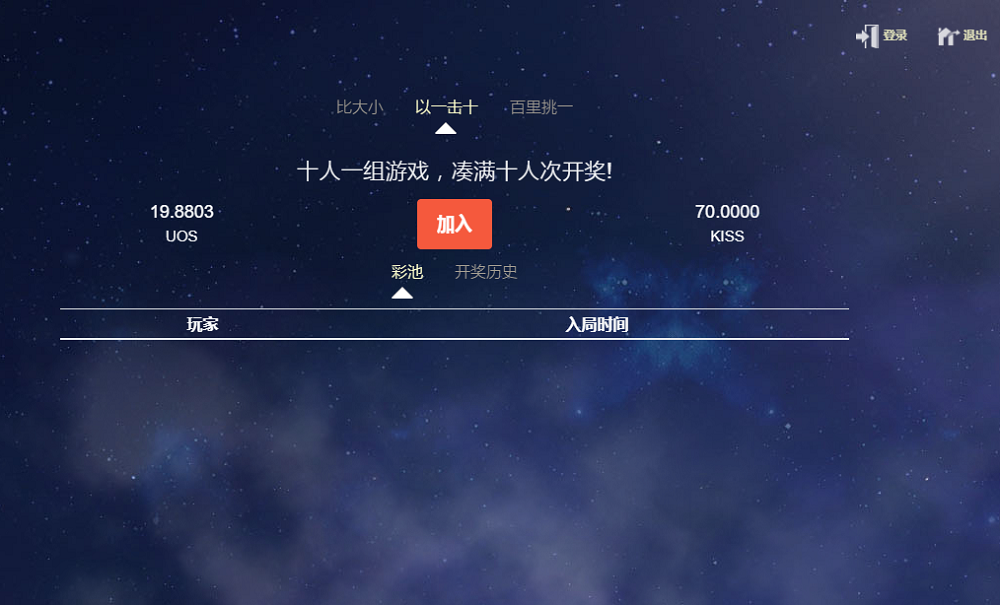
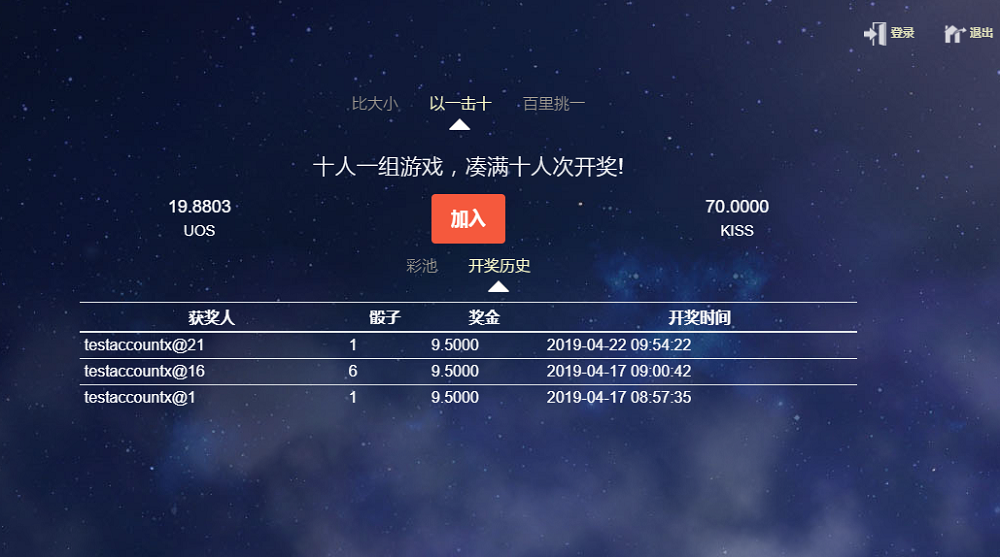

# 第十三章 DApp开发

## **概述**

DApp是Decentralized Application的缩写，译为:分散式的应用程序。App我们都知道，我们在智能移动端上安装的应用程序也就是App。而DApp比App多了一个‘D’，‘D’的意思是分散式的。所以，它的意思是分散式的应用程序/去中心化的应用程序。

## **准备**

为了能够开发UOS DApps，您需要懂得使用C / C ++技术开发，因为这是用于UOS智能合约的编程语言。在DApp开发之前，我们需要准备以下技能或工具：

1.   C / C ++

2.   Linux命令行知识

3.   编辑器或IDE（eclipse、clion、Sublime Text、vs code等）

4.   一个运行的本地测试网络节点

5.   前、后端服务器

## **基本流程**

1.  创建账户

   使用rpc命令[cluos system newaccount](https://mastering-uos.gitbook.io/mastering-uos/di-wu-zhang-cluos#12-1-system-newaccount)。

2.  开发、编译合约

   使用合约编译工具[uosio.cdt](https://mastering-uos.gitbook.io/mastering-uos/di-shi-yi-zhang-uosio.cdt)进行编译

3.  部署、调试合约

   使用rpc命令[cluos set contract](https://mastering-uos.gitbook.io/mastering-uos/di-wu-zhang-cluos#5-3-set-contract) 部署合约。

   由于没有专用的调试工具，一般使用print函数打印信息进行调试。

4.  DApp前后端开发

   需要使用相关的[api](https://mastering-uos.gitbook.io/mastering-uos/di-si-zhang-noduos#noduos-chang-yong-api)及[uosjs](https://mastering-uos.gitbook.io/mastering-uos/di-shi-er-zhang-uosjs-zan-wu)相关库文件。

5.  合约及前后端联调

6.  测试

## **注意事项**

1.  通常情况下，DApp需要调用钱包，我们具有支持Chrome浏览器的钱包工具—Usmart。请到Chrome网上应用店查询Usmart并安装。

2.  uosio.cdt并不能用于编译老版本的合约，因此开发合约时请按照uosio.cdt的语法规则及合约格式。

3.  合约调试时，注意设置配置文件config.ini中contracts-console选项为true。

4.  uosjs还未完善，因此，DApp前后端开发会存在一些困难，后续我们将持续完善。

## dicegame游戏

### 游戏说明

这是一个简单的区块链游戏，该游戏结合了骰子游戏和抽奖游戏，具有三种游戏模式：比大小、以一击十、百里挑一。

**比大小**：玩家在2-95中押注骰子点数，押注金额可选择0.5-10 UOS；当掷出的骰子点数（1-100）小于您所选的骰子点数，则您获胜，赢取金额为---投注金额 \* 98/\(押注点数 - 1\)（精确到小数点后两位）。

**以一击十**：位玩家固定投注1 UOS（玩家可多次投注），满十人次投注即可开奖，从这十名玩家中随机选择一名玩家赢取奖金（9.5 UOS）。

**百里挑一**：每位玩家固定投注1 UOS（玩家可多次投注），满一百人投注即可开奖；从这一百名玩家中随机选择一名玩家，赢取奖金（95 UOS）。

### 架构

#### **文件结构**



该项目分分三个部分，contract（合约）、resolver\(后台开奖程序，姑且称为后端\)、www\(采用revel框架，包含js、go、html等，姑且称为前端\)。

合约及后端部分，文件相对较少，前端部分app文件夹存放go程序（该部分应该归属于后端部分，但这里不做明确区分）和html文件，conf文件夹存放revel的配置文件，public文件夹存放js、css、图片等。

#### **系统架构**

该Dapp主要包含四个部分：智能合约、前端、后端、数据库，该项目前、后端结合比较紧密，此处我们说的后端指狭隘的后端，仅指resolver（结算程序）；前端指的是大前端，包含了一部分后端逻辑，我们也将Usmart归属于这部分。

简单的系统架构图如下：



根据上图，智能合约（contract）部署在区块链（blockchain）上，后端（resolver）与区块链进行交互，获取信息并存储在数据库（DB）中，如果存在需要结算的押注，则结算；前端读取数据库内容，更新到界面，如果有玩家参与游戏，则与Usmart交互，并将交易上链。

#### **流程**

1.  安装并配置Usmart钱包（配置网络、导入私钥、配置身份）。

2.  玩家在前端页面选择点数和押注金额，点击“下注”按钮，前端将会根据玩家的参数构建转账交易，Usmart签名并推送该交易上链。

3.  后端检索合约中表格，发现存在记录，则选择相应的区块ID对其进行开奖，并发起内联转账进行结算。

4.  后端将开奖记录入库，并展示到前端页面。

### 环境

#### **开发环境**

操作系统：Windows 10企业版

开发工具：

* vs code
* go
* node js
* c++

#### **生产环境**

操作系统：ubuntu 16.04

工具：

* uos
* uosio.cdt
* go
* node js 
* c++
* sqlite3
* revel框架

### 智能合约

#### **表结构（multi\_index）**

全局变量：

| 字段名 | 字段类型 | 字段说明 |
| :--- | :--- | :--- |
| id | uint64\_t | 主键，ID |
| next\_osid | uint64\_t | 比大小下一个ID |
| next\_grp10id | uint64\_t | 以一击十下一个ID |
| next\_grp100id | uint64\_t | 百里挑一下一个ID |
| os\_cnt | int64\_t | 比大小当前参与人次 |
| grp10\_cnt | int64\_t | 以一击十当前参与人次 |
| grp100\_cnt | int64\_t | 百里挑一当前参与人次 |
| freezed | bool | 冻结合约 |
| min\_celling | int8\_t | 玩家选择点数下限 |
| max\_celling | int8\_t | 玩家选择点数上限 |
| min\_amount | int64\_t | 玩家押注金额下限 |
| max\_amount | int64\_t | 玩家押注金额上限 |

比大小押注记录：

| 字段名 | 字段类型 | 字段说明 |
| :--- | :--- | :--- |
| osid | uint64\_t | 主键，ID |
| player | name | 玩家 |
| amt | uint64\_t | 投入金额 |
| celling | uint8\_t | 投注点数 |
| microsec | uint64\_t | 投注时间\(毫秒\) |

轮盘投注记录：（以一击十、百里挑一通过scope来区分）

| 字段名 | 字段类型 | 字段说明 |
| :--- | :--- | :--- |
| rltid | uint64\_t | 主键，ID |
| player | name | 玩家 |
| microsec | uint64\_t | 投注时间\(毫秒\) |

#### **合约接口**

**1.**  **onTransfer（）：**

非action，该函数用于玩家进行押注，玩家通过向合约账户转账来触发该函数，合约通过解析备注来获取游戏模式，及其他参数，这并不是一个对外提供的接口，此处写明为了易于理解。

**2.**  **resolveos（）：**

action，比大小模式结算，需要合约账户权限。

开奖结果计算公式：sum\( sha256\(未来区块ID + 游戏ID\) \) % 100 + 1

**3.**  **resolvegrp（）：**

action，以一击十、百里挑一模式开奖，需要合约账户权限。

开奖结果计算公式：sum \( sha256\( 未来区块ID \) \) % 10 \(或100\)

### 后端（resolver）

#### **运行原理**

后端创建多个（7个）线程，4个线程用于获取链上数据，3个线程用于结算。每个线程都是一个死循环，数据获取线程获取到数据后会存入数据中；结算线程从数据库查询记录，如果有符合要求的数据则进行结算。数据获取线程：获取区块信息、获取比大小押注记录、获取以一击十参与记录、获取百里挑一参与记录；结算线程：结算比大小、结算以一击十、结算百里挑一。

#### **表结构**

未结算比大小押注记录表格OneshotTbl：主键为OneshotInfo.OsID

| 字段名 | 字段类型 | 字段说明 |
| :--- | :--- | :--- |
| OneshotInfo | 自定义 | 投注信息（查询合约表格获取） |
| Solved | bool | 是否结算 |
| LastSolveSec | int64 | 结算时间 |
| LastOnchainSec | int64 | 最后一次查找到该记录的时间戳 |
| BlkNum | uint64 | 押注区块高度 |
| BlkHash | string | 押注区块ID |
| DiceVal | uint8 | 押注点数 |

```go
type OneshotInfo struct {       
    OsID     uint64 `json:"osid"`           //主键，押注id
    Player   string `json:"player"`         //玩家
    Amt      int64  `json:"amt"`            //金额
    Celling  int64  `json:"celling"`        //押注点数
    MicroSec int64  `json:"microsec,string"`    //押注时间
}
```

未结算抽奖模式参与记录表格GroupTbl：主键为GroupItem.RltID、GrpType

| 字段名 | 字段类型 | 字段说明 |
| :--- | :--- | :--- |
| GroupItem | 自定义 | 投注信息（查询合约表格获取） |
| Solved | bool | 是否结算 |
| LastSolveSec | int64 | 结算时间 |
| LastOnchainSec | int64 | 最后一次查找到该记录的时间戳 |
| GrpType | string | 主键，10人组或100人组 |
| BlkNum | uint64 | 区块高度 |
| BlkHash | string | 区块ID |

```go
type GroupItem struct {
    RltID    int64  `json:"rltid"`              //ID，主键
    MicroSec int64  `json:"microsec,string"`    //参与时间
    Player   string `json:"player"`             //玩家
}
```

区块信息表格BlockInfoTbl：

| 字段名 | 字段类型 | 字段说明 |
| :--- | :--- | :--- |
| BlockNum | uint64 | 主键，区块高度 |
| MicroSec | int64 | 出块时间（毫秒） |
| TmStr | string | 出块时间戳 |
| BlockHash | string | 区块ID |
| From | string | 区块节点rpcURL |

比大小历史记录表格DiceHistoryTbl：

| 字段名 | 字段类型 | 字段说明 |
| :--- | :--- | :--- |
| ResolveDate | time.Time | 结算时间 |
| OsID | uint64 | 主键，比大小押注ID |
| BlkNum | uint64 | 用于结算的区块高度 |
| BlkID | string | 用于结算的区块ID |
| DiceVal | uint8 | 骰子点数 |
| MicroSec | uint64 | 区块时间 |
| Celling | uint8 | 上限 |
| Player | string | 玩家 |
| Result | string | 输赢结果 |
| Bet | string | 押注金额 |
| Reward | string | 返回金额 |
| BetDate | string | 押注时间 |
| AccountActSeq | uint64 | action序号 |

多人模式历史记录表格GroupHistoryTbl：

| 字段名 | 字段类型 | 字段说明 |
| :--- | :--- | :--- |
| ResolveDate | string | 结算时间 |
| BlkNum | uint64 | 区块高度 |
| BlkID | string | 区块ID |
| DiceVal | uint64 | 中奖序号（0-9或0-99 |
| MicroSec | uint64 | 时间 |
| Reward | string | 奖金 |
| GrpType | string | 10人组或100人组 |
| Winner | string | 中奖人 |
| WinnerID | uint64 | 中奖人投注ID |
| AccountActSeq | uint64 | 主键，action序号 |

#### **程序框架**

> main\(\)
>
>    └─RunResolve\(\)
>
>             ├─initDB\(\)//初始化数据库
>
>             ├─refreshHeadBlk\(\)//获取投节点区块（即存储区块数据起始区块）
>
>             ├─fetchBlkInfoRoutine\(\)
>
>             │            ├─refreshHeadBlk\(\)
>
>             │            └─fetchBlockInfo\(blkNum uint64\)
>
>             ├─fetchOneshotsRoutine\(\)
>
>             │            └─fetchOneshots\(\)
>
>             ├─fetchGroupRoutine\("group10"\)
>
>             │            └─fetchGroup\(group string\)
>
>             ├─fetchGroupRoutine\("group100"\)
>
>             │            └─fetchGroup\(group string\)
>
>             ├─solveGroupRoutine\("group10"\)
>
>             │            └─doSolveGroup\(group string, rangeBeginID int64\)
>
>             │                      └─execCmd\(args \[\]string\)
>
>             ├─solveGroupRoutine\("group100"\)
>
>             │            └─doSolveGroup\(group string, rangeBeginID int64\)
>
>             │                      └─execCmd\(args \[\]string\)
>
>             └─solveOneshotsRoutine\(\)
>
>                           └─doSolveOneshot\(os \*OneshotInfo\)
>
>                                      └─execCmd\(args \[\]string\)

**1.  RunResolve\(\)**

将所有需要调用的接口封装进该函数，创建多个线程并发调用这些函数。



```go
func (c *ResolverCtrl) RunResolve() error {
    c.initDB()
    if err := c.refreshHeadBlk(); nil != err {
        log.Printf("main - ctrl.refreshHeadBlk failed : %v", err)
        return err
    }
    go c.fetchBlkInfoRoutine()
    go c.fetchOneshotsRoutine()
    go c.fetchGroupRoutine("group10")
    go c.fetchGroupRoutine("group100")
    go c.solveGroupRoutine("group10")
    go c.solveGroupRoutine("group100")
    c.solveOneshotsRoutine()
    return fmt.Errorf("Unwished exit from ResolverCtrl.Run")
}
```



**2.  fetchBlkInfoRoutine\(\)**

获取区块信息，每隔10秒调用一次，仅查询并存储区块高度能整除10的区块的信息。该函数查询数据库表格BlockInfoTbl的最大索引，通过api命令get\_block获取新的区块的信息并插入到表格BlockInfoTbl。

**3.  fetchOneshotsRoutine\(\)**

通过api命令get\_table\_rows获取比大小模式（未结算）押注记录，每隔1秒调用一次，因为UOS每隔1秒产生一个新的区块。该函数查询合约中比大小模式押注记录，如果合约中存在数据则更新本地数据库表OneshotTbl。

**4.  fetchGroupRoutine\(group  string\)**

参数：

| 名称 | 类型 | 说明 |
| :--- | :--- | :--- |
| group | string | 游戏类型，group10/group100 |

通过api命令get\_table\_rows获取10人组和100人组（未结算）参与记录，每隔5秒调用一次，因为该模式需要10人或100参与才能开奖，时间间隔可以相对长一些。该函数查询合约中多人抽奖参与记录，如果合约中存在数据则更新本地数据库表GroupTbl。

**5.  solveGroupRoutine\(group  string\)**

参数：

| 名称 | 类型 | 说明 |
| :--- | :--- | :--- |
| group | string | 游戏类型，group10/group100 |

结算多人组游戏模式，间隔10秒调用一次，该函数读取数据库表格GroupTbl中所有记录，如果达到结算要求（10人组不少于10人次，100人组不少于100人次）则进行抽奖结算。

**6.  solveOneshotsRoutine\(\)**

结算比大小游戏模式，间隔1秒调用一次，该函数读取数据库表格OneshotTbl中所有记录进行结算。

**7.  GetDiceHisTbl\(player string, highBound uint64, limit int\)**

参数：

| 名称 | 类型 | 说明 |
| :--- | :--- | :--- |
| player | string | 玩家账户，暂未使用 |
| highBound | uint64 | 主键上限 |
| limit | int | 返回条目限制 |

获取数据库表格DiceHistoryTbl中数据，前端调用该接口获取历史数据。实际相当于SQL语句：SELECT \* FROM DiceHistoryTbl WHERE OsID&lt; highBound ORDER BY OsID DESC LIMIT limit

**8.  GetGrpHisTbl\(group string, limit, offset int64\)**

参数：

| 名称 | 类型 | 说明 |
| :--- | :--- | :--- |
| group | string | 游戏类型 |
| limit | int64 | 返回条目限制 |
| offset | int64 | 偏移量 |

获取数据库表格GroupHistoryTbl中数据，前端调用该接口获取历史数据。实际相当于SQL语句：SELECT \* FROM GroupHistoryTbl WHERE GrpType=group ORDER BY AccountActSeq DESC LIMIT limit OFFSET offset

### 前端

#### **界面效果**







#### **基本流程**

**比大小**：用户登陆-&gt;选择押注金额及点数-&gt;点击“下注”按钮-&gt;构建交易-&gt;Usmart签名并发送交易-&gt;自动刷新页面

**以一击十/百里挑一**：用户登录-&gt;点击“加入”按钮-&gt;构建交易-&gt;Usmart签名并发送交易-&gt;自动刷新页面

#### **主要接口**

**1.  GetGrpHisTbl\(\)**:查询GroupHistoryTbl表格,实际是对后端的GetGrpHisTbl接口进行一次封装。



```go
func (c App) GetGrpHisTbl(chain, group string, limit, offset int64) revel.Result {
    /*与resolver程序交互，获取数据*/
    grps, err := rsvCtrl.GetGrpHisTbl(group, limit, offset)
    if nil != err {
        return c.RenderJSON(CommResp{
            Result: -1,
            Desc:   "DB query error",
            Data:   nil,
        })
    }
    return c.RenderJSON(CommResp{
        Result: 0,
        Desc:   "OK",
        Data:   grps,
    })
}
```



**2.  GetBetHistory\(\)**:查询DiceHistoryTbl表格,实际是对后端的GetDiceHisTbl接口进行一次封装。



```go
func (c App) GetBetHistory(chain, player string, highBound uint64, limit int) revel.Result {
    /*与resolver程序交互，获取数据*/
    hises, err := rsvCtrl.GetDiceHisTbl(player, highBound, limit)
    if nil != err {
        log.Printf("App.GetBetHistory - failed : %v")
        return c.RenderJSON(CommResp{
            Result: -1,
            Desc:   "DB query error",
            Data:   nil,
        })
    }
    return c.RenderJSON(CommResp{
        Result: 0,
        Desc:   "OK",
        Data:   hises,
    })
}
```



**3.**  **login\(\)登录：**



```javascript
function login(){
    if(cachedAccount != ""){
        console.log(cachedAccount + " has logged in");
        notify_message(cachedAccount + " has logged in");
        return;
    }
    cachedAccount = getCookie("cachedAccount");
    if(cachedAccount == undefined || cachedAccount == ""){
        cachedAccount = "";
        alert_message("请选择Usmart的登录帐号！");
        usmartAction('uosio', function(){   //身份验证并设置cookie
            refresh_all();      //刷新余额
        });
    }else{
        refresh_all();
    }
}
```



根据代码可以看出，该操作仅更新了cookie缓存（账户名），以及查询玩家账户的相关信息。该函数多个地方会调用：打开/刷新页面、点击“登录”按钮、点击“下注”/“加入”按钮。

**4.**  **logout\(\)退出：**



```javascript
function logout(){
    cachedAccount = "";
    setCookie("cachedAccount", "");
    refresh_all();
    usmart.forgetIdentity().then((e) => {
        console.log("logout ok");
    }).catch(e=>{
        console.log("logout failed : " + e.message);
    });
}
```



该操作清除cookie缓存，并刷新玩家的余额信息。

**5.**  **click\_bet\(\)下注：**



```javascript
function click_bet(){
    if("" == cachedAccount){
        console.log("login","这里再登录一次")
        login();
        return;
    }
    usmartAction(get_transfer_contract(), function(contract, account){
        var celling_slider = document.getElementById('id_slider_celling');
        var bet_slider = document.getElementById('id_slider_bet');
        var celling = parseInt(celling_slider.noUiSlider.get());
        var tmp = bet_slider.noUiSlider.get();
        var bet = parseFloat(tmp).toFixed(4);
        var invitor = getCookie("invitor");
        if(celling > MAX_CELLING || celling < MIN_CELLING){
            alert_message("押注标的应该在2到96之间！");
            console("押注标的应该在2到96之间，当前值:" + celling);
            return;
        }
        if(parseFloat(bet) > MAX_BET || parseFloat(bet) < MIN_BET){
            alert_message("押注标的应该在0.5到10之间！");
            console("押注标的应该在0.5到10之间，当前值:" + bet);
            return;
        }
        const opts = { authorization:[account.name+'@'+account.authority] };
        var memostr = "oneshot;" + invitor + ";" + celling;
        console.log("memostr",memostr)
        console.log("转账",`"from":${account.name},"to":${DICE_SERVANT}, "quantity":${(bet + " UOS")}, "memo":${memostr}`)
        /* cluos push action uosio.token transfer '{"from":"player","to":"dice","quantity":"10.0000 UOS","memo":"oneshot;;50"}' -p player */
        contract.transfer(account.name, DICE_SERVANT, bet + " UOS", memostr).then(trx => {
            console.log(`Transaction ID: ${trx.transaction_id}`);
            notify_message("操作成功！")
        }).catch(e => {
            alert_message("转账失败 ：" + e.message);
            console.error(e);
        });
        refresh_all();//刷新页面（调用查询账户函数)
    });
}
```



点击下注按钮，如果没有登录，则进行登录后返回（未下注）；如果已经登录，则构建交易，并使用Usmart签名和发送交易。

**6.**  **click\_grp\(\)加入：**和click\_bet类似



```javascript
function click_grp(grp){
    if("" == cachedAccount){
        login();
        return;
    }
    if(grp != "group10" && grp != "group100"){
        console.log("grp param invalid : " + grp);
        alert_message("grp param invalid : " + grp);
        return;
    }
    usmartAction(get_transfer_contract(), function(contract, account){
        var invitor = getCookie("invitor");
        const opts = { authorization:[account.name+'@'+account.authority] };
        var memostr = grp + ";" + invitor + ";";
        contract.transfer(account.name, DICE_SERVANT, "1.0000 UOS", memostr).then(trx => {
            console.log(`Transaction ID: ${trx.transaction_id}`);
            notify_message("加入成功！")
        }).catch(e => {
            alert_message("转账失败 ：" + e.message);
            console.error(e);
        });
        refresh_all();
    });
}
```



**7.**  **updateBetHistory\(\)刷新押注历史：**



```javascript
function updateBetHistory(){
    var high = 999999999;
    var limit = 20;
    var args = "highBound="+high+"&limit="+limit+"&blockchain="+dice_blockchain;
    $.ajax({type:'post',
            url:"/App/GetBetHistory?" + args,
            contentType: "application/json; charset=utf-8",
            error:function(XMLHttpRequest, textStatus, errorThrown){ 
                alert_message("查询押注历史失败!"+textStatus);
                var msg = "" + textStatus + "." + errorThrown;
                console.log("查询押注历史失败 : " + msg);
            },
            success:function(resp){
                var tblobj = $("#id_tbody_allhis");
                if(resp.Result != 0){
                    console.log(resp)
                    var msg = "查询押注历史错误 : " + resp.Desc;
                    alert_message(msg);
                    console.log(msg);
                    return;
                }
                tblobj.empty();               
                for(var idx = 0; idx < resp.Data.length; idx ++){
                    var his = resp.Data[idx];
                    $('<tr class="text-light">'+
                      '<td>' + his.Player + "@" + his.OsID + '</td>' +
                      '<td>' + his.Bet.replace(" UOS", "") + '</td>' +
                      '<td class=' + ((his.DiceVal < his.Celling) ? "text-danger lgfont" : "text-secondary") + '>' + his.Reward.replace(" UOS", "") + '</td>' +
                      '<td>' + his.DiceVal + "/" + his.Celling + '</td>' +
                      '<td class="text_left">' + (new Date(his.BetDate)).Format("yyyy-MM-dd hh:mm:ss") + '</td>' +
              '</tr>').appendTo(tblobj);
                }
            },
    });
}
```



该接口使用ajax获取并显示数据到页面，数据查询函数GetBetHistory。

**8. 监听Usmart插件是否安装并加载：**



```javascript
document.addEventListener('usmartLoaded', usmartExtension => {
    usmart = window.usmart;
    if(usmart == null){
        alert_message("请先安装并配置好Usmart!");
        return
    }
    if(navigator.userAgent.includes("MdsApp")){
        window.usmart = null;
    }else{
        delete window.usmart;
    }
    //自动登录
    login();
});
```



**9. （主页）页面初始化：**



```javascript
$(document).ready(function(){   //初始化
    ……        //省略
    var invitor = getURLParams("ref")
    if(null != invitor){
        setCookie("invitor",invitor);
    }
    login();            //登录
    setInterval(updateBetHistory, 3000); //设置定时器，刷新比大小记录
    setInterval(refresh_group_wrapper, 3000); //刷新多人模式记录
    $("#id_welcome_modal").modal('show');
});
```



初始化函数主要操作：获取推荐人并存储到cookie，玩家登录，刷新历史记录。


