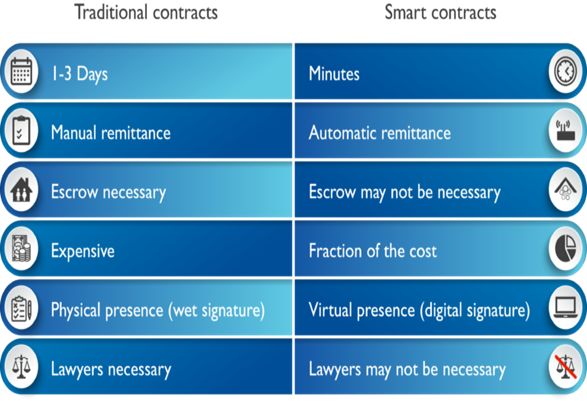

# 第五章 智能合约介绍

## 智能合约概述

智能合约是1994年由尼克萨博首次提出的理念，是一种旨在以信息化方式传播、验证或执行合约的计算机协议。智能合约允许在没有第三方的情况下进行可信交易。这些交易可追踪且不可逆。

区块链技术给我们带来了一个去中心化的，不可篡改的，高可靠性的系统，在这种环境下，智能合约才大有用武之地。智能合约是区块链最重要的特性之一，也是区块链能够被称为颠覆性技术的主要原因。

我们为什么需要使用智能合约？

我们可以在区块链上签订合同来实现许多解决方案的自动化，这样使得这个事情变得简单而高效。接下来我们比较智能合约和传统合约，在哪些方面更具有优势，如下图所示：



UOS智能合约是与UOS上某个用户绑定在一起的程序。UOS合约默认是有主语的，即是谁的合约。在合约没有部署之前的程序叫做合约程序。

## 开发要求

**开发经验**

* C / C++ 开发经验
* 需要安装 usoio.cdt C++工具链。 请参考usoio.cdt的编译安装文档
* Linux使用经验

usoio支持环境：Ubuntu 16.04 及以上 ，会基本的linux使用。

* 命令行知识

usoio提供了各种工具，这些工具要求您具备基本的命令行知识，以便与之进行交互。

**C++环境设置**

本质上可以使用任何文本编辑器，最好支持C++语法高亮显示。流行的编辑器有Sublime Text和Atom。另一个选项是IDE，它提供更复杂的代码完成和更完整的开发体验。欢迎您使用您个人喜欢的软件，如果您不确定使用什么，我们提供了一些选项供您选择。

可用的编辑器和IDE：

* [source insight](https://www.sublimetext.com/)
* [Sublime Text](https://www.sublimetext.com/)
* [Atom Editor](https://atom.io/)
* [CLion](https://www.jetbrains.com/clion/)
* [Eclipse](http://www.eclipse.org/downloads/packages/release/oxygen/1a/eclipse-ide-cc-developers)
* [Visual Studio Code](https://code.visualstudio.com/)

推荐uosio.cdt 的代码和你的编译源码一起看。uosio.cdt有例子，很容易做到举一反三。而且查询接口也很容易查。你自己的程序也可以放到 ~/uosio.cdt/examples 目录下，方便比较。

##  UOS合约示例

写合约最好在别人的模板上面改，框架就不用写了，而且可以减少犯错的概率。加快开发速度。/uosio.cdt/examples 提供了一些例子，可以借鉴。

下面以 addressbook.cpp 为例 讲一下合约的编写。

```text
#include <uosiolib/uosio.hpp>   //合约库的头文件
#include <uosiolib/print.hpp>   //使用打印输出，调试时候用

using namespace uosio;     //uos合约的命名空间，接口都是在这个命名空间内

class [[uosio::contract]] addressbook : public uosio::contract {
//[[uosio::contract]]表示这个是合约，名称为 addressbook，必须从uosio::contract 继承
public:
  using contract::contract;   //直接使用 contract::contract 类型
  
  addressbook(name receiver, name code,  datastream<const char*> ds): contract(receiver, code, ds) {}   //构造函数
  
  [[uosio::action]] 
  void upsert(name user, std::string first_name, std::string last_name, std::string street, std::string city, std::string state) {
    require_auth(user);   //需要 user用户的授权，即user用户发起的交易就可以执行。
    address_index addresses(_code, _code.value);
    auto iterator = addresses.find(user.value);   //在表中查找user的对象
    if( iterator == addresses.end() )   //没找到则插入
    {
      addresses.emplace(user, [&]( auto& row ){
       row.key = user;
       row.first_name = first_name;
       row.last_name = last_name;
       row.street = street;
       row.city = city;
       row.state = state;
       send_summary(user, " successfully emplaced record to addressbook");
       increment_counter(user, "emplace");
      });
    }
    else {   //找到记录则更新
      std::string changes;
      addresses.modify(iterator, user, [&]( auto& row ) {
        if(row.first_name != first_name) {   //如果新的名字和旧名字不一样
          row.first_name = first_name;   //使用新名字替换旧名字
          changes += "first name ";   //记载操作记录
        }
        if(row.last_name != last_name) {
          row.last_name = last_name;
          changes += "last name ";
        }
        if(row.state != state) {
          row.state = state;
          changes += "state ";
        }
      });
      if(changes.length() > 0) {
        send_summary(user, "successfully modified record in addressbook. Fields changed: " + changes);   //发送通知信息
        increment_counter(user, "modify");   //用于操作统计
      } else {
        send_summary(user, "called upsert, but request resulted in no changes.");
      }
    }
  }
  
  [[uosio::action]]
  void erase(name user) {   //删除操作
    require_auth(user);
    address_index addresses(_code, _code.value);
    auto iterator = addresses.find(user.value);
    uosio_assert(iterator != addresses.end(), "Record does not exist");
    addresses.erase(iterator);
    send_summary(user, " successfully erased record from addressbook");
    increment_counter(user, "erase");
  }
  
  [[uosio::action]]   //通知操作。合约本身有执行自己的权限
  void notify(name user, std::string msg) {
    require_auth(get_self());   //合约本身有执行自己的权限
    require_recipient(user);   //通知 user用户
  }
  
private:
  struct [[uosio::table]] person {   //合约的数据结构
    name key;
    std::string first_name;
    std::string last_name;
    std::string street;
    std::string city;
    std::string state;
    
    uint64_t primary_key() const { return key.value; }
  };
  
  void send_summary(name user, std::string message) {   //发送通知信息
    action(
      permission_level{get_self(),"active"_n},
      get_self(),
      "notify"_n,
      std::make_tuple(user, name{user}.to_string() + message)
    ).send();
  };
  
  void increment_counter(name user, std::string type) {   //发送计数交易
    action counter = action(
      permission_level{get_self(),"active"_n},   //合约发布者的 active权限
      "abcounter"_n,        //合约发布者名称
      "count"_n,            //合约发布者发布的函数
      std::make_tuple(user, type)
    );
    counter.send();
  }
  
  typedef uosio::multi_index<"people"_n, person> address_index;   //合约表的索引结构
};

UOSIO_DISPATCH( addressbook, (upsert)(notify)(erase))   //申明合约可以被调用的接口
```

##  转换EOS合约

Uos的合约开发工具和eos的合约开发工具基本是一致的，eos 1.5版本的接口名称 uos1.5版本全部支持。

比如用户要做addressbook.cpp 合约转为在 UOS下可以使用的合约，那么只需要做一下替换， 以addressbook.cpp为例， 原有的addressbook.cpp 里面的eos 、 EOS 直接替换为uos、UOS 即可变为uos下面的合约。

EOS ==》UOS

eos ==》uos

然后 直接进行编译即可。

```text
uosio-cpp addressbook.cpp -o addressbook.wasm –abigen 
```

使用uosio-cpp进行编译 。

编译出的 addressbook.abi    addressbook.wasm 即可在uos公链上面进行使用。

